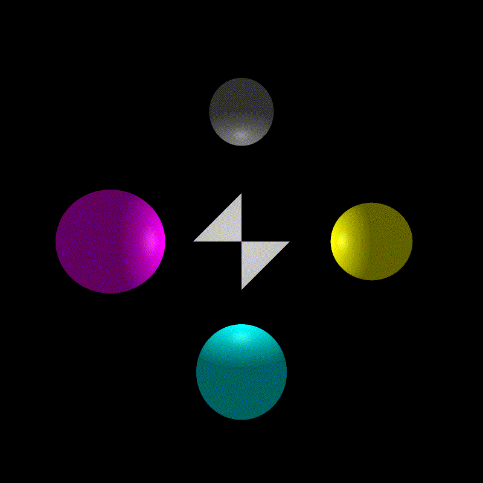

# Ray tracer

A ray tracer I'm building to learn C++ and to practice what I learned in CSCI-711 Global Illumination. Instead of generating a static image, however, this program takes input files that define animation keyframes for each of the objects in the scene and uses them to generate a series of frames which can be strung together as an animation, like the image above.

### Current Functionality
+ Can render spheres and triangles with flat shading
+ Can parse input files like [this](Raytracer/world/anim1.sphere) that define keyframes for one object
+ Can use keyframes to produce a series of images that can be turned into a gif/mp4

### Next Tasks
+ Phong shading
+ KD Tree
+ Catmull-Rom interpolation

### Dependencies
+ Relies on the [LodePNG](https://github.com/lvandeve/lodepng) NuGet package for writing .png files.
+ Relies on the [GLMathematics](https://www.nuget.org/packages/glm/0.9.9.600) NuGet package for matrix/vector math
